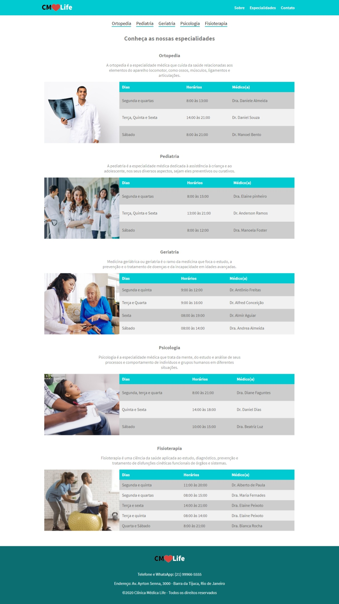

# Clínica Média Life

O desenvolvimento deste projeto, foi solictado pela plataforma de cursos [DevMedia](https://www.devmedia.com.br/) na carreira [Front-End](https://www.devmedia.com.br/carreira-programador/?slug=front-end). Foi utilizada a linguagem de marcação HTML e de estilizaçao CSS.

Este projeto, ajudou a fixar o conhecimento em responsividade, adquirido no curso.

## Layout Página Home

## Layout Página Especialidades

## Visualizar projeto

Para visualizar o projeto corretamente, é indicado utilizar um servidor como WampServer